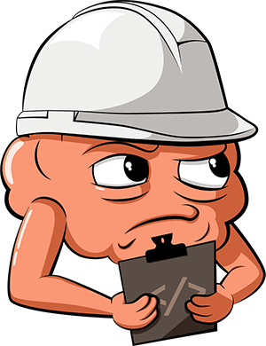

# Cerebral
A state controller with its own debugger

[](https://discord.gg/0kIweV4bd2bwwsvH)
[](https://travis-ci.org/cerebral/cerebral)



## The Cerebral Webpage is now launched
You can access the webpage at [http://www.cerebraljs.com/](http://www.cerebraljs.com/). You will find all the information you need there.

- [How to create a custom Cerebral VIEW package](#how-to-create-a-custom-cerebral-view-package)
- [How to create a custom Cerebral MODEL package](#how-to-create-a-custom-cerebral-model-package)

## How to create a custom Cerebral VIEW package
**view** packages in Cerebral just uses an instantiated Cerebral controller to get state, do state changes and listen to state changes. The package you create basically just needs an instance of a Cerebral controller and you will have access to the following information.

```js
// The controller instantiated can be passed to the package. With React it is
// done so with a wrapper component and with Angular using a provider. You have
// to decide what makes sense for your view layer  
function myCustomViewPackage (controller) {

  // Get state
  controller.get(path);

  // Listen to state changes
  controller.on('change', function () {

  });

  // Listen to debugger time traversal
  controller.on('remember', function () {

  });

};
```
That is basically all need to update the **view** layer.

## How to create a custom Cerebral MODEL package
In this example we will use Baobab.

*index.js*
```js
var Baobab = require('baobab');
var deepmerge = require('deepmerge');

var Model = function (initialState, options) {

  options = options || {};

  var tree = new Baobab(initialState, options);

  var model = function (controller) {

    controller.on('reset', function () {
      tree.set(initialState);
    });

    controller.on('seek', function (seek, isPlaying, recording) {
      var newState = deepmerge(initialState, recording.initialState);
      tree.set(newState);
    });

    return {
        tree: tree,
        get: function (path) {
          return tree.get(path);
        },
        toJSON: function () {
          return tree.toJSON();
        },
        export: function () {
          return tree.serialize();
        },
        import: function (newState) {
          var newState = deepmerge(initialState, newState);
          tree.set(newState);
        },
        mutators: {
          set: function (path, value) {
            tree.set(path, value);
          },
          unset: function (path) {
            tree.unset(path);
          },
          push: function (path, value) {
            tree.push(path, value);
          },
          splice: function () {
            tree.splice.apply(tree, arguments);
          },
          merge: function (path, value) {
            tree.merge(path, value);
          },
          concat: function () {
            tree.apply(path, function (existingValue) {
              return existingValue.concat(value);
            });
          },
          pop: function (path) {
            tree.apply(path, function (existingValue) {
              existingValue.pop();
              return existingValue;
            });
          },
          shift: function (path) {
            tree.apply(path, function (existingValue) {
              existingValue.shift();
              return existingValue;
            });
          },
          unshift: function (path, value) {
            tree.unshift(path, value);
          }
        }
    };

  };

  model.tree = tree;

  return model;

};

Model.monkey = Baobab.monkey;

module.exports = Model;
```

## Demos
**TodoMVC**: [www.christianalfoni.com/todomvc](http://www.christianalfoni.com/todomvc)

## Cerebral - The beginning
Read this article introducing Cerebral: [Cerebral developer preview](http://christianalfoni.com/articles/2015_05_18_Cerebral-developer-preview)

## Contributors
- **Marc Macleod**: Discussions and code contributions
- **Petter Stenberg Hansen**: Logo and illustrations
- **Jesse Wood**: Article review

Thanks guys!
