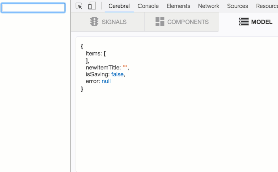
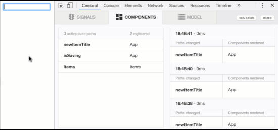

* [Try the demo](http://cerebral.github.io/cerebral-todomvc/)
* [Tutorial](./tutorial-introduction/introduction.en.md)
* [Get Started](./get-started/get-started.en.md)

## Model
With Cerebral you define the state of your application as a single model: a single state tree. This state tree manages *all* application state, whether from a server, like a list of users, or client side state, like the currently selected tab of a UI.

All state changes are reflected live in the debugger, giving you a complete picture of how your application behaves. You can even edit the state tree directly and see the changes immediately in your application's UI.

###### controller.js

```js
import Model from 'cerebral/models/immutable'
import {Controller} from 'cerebral'

const model = Model({
  newItemTitle: '',
  isLoading: false,
  items: [],
  error: null
})

const controller = Controller(model)

export default controller
```

###### Debugger



------

## Controller

The Cerebral controller is where you define all state changing logic in your application-- code that runs after a button click or a received websocket message, for example.

State changes are modeled using **signals**. Signals execute **chains** with **actions**. Actions are simply Javascript functions; Chains are groupings of one or more functions, executed in order, and signals bind application events to chains.

The debugger knows when signals trigger and what data goes through them, giving you great insight into your application.

###### submitNewItemTitle.js

```js
import {set} from 'cerebral/operators'
import addItem from '../actions/addItem'

export default [
  addItem,
  set('state:newItemTitle', ''),
  set('state:isSaving', true),
  postItem, {
    success: [
      updateItem
    ],
    error: [
      removeFailedItem
    ]
  },
  set('state:isSaving', false)
]
```

###### Debugger


------

## View

Components get data from one or more state paths. When a change occurs in the model, Cerebral notifies the view layer about what paths have changed. Rendering is highly optimized since components only re-render if their registered state paths have actually changed.

The debugger lets you know all the current active state paths and what components are rendered when these state paths change.

###### React

```js
import React from 'react'
import {connect} from 'cerebral-view-react'

export default connect({
  items: 'items'
},
  function Items(props) {
    return (
      <ul>
        {this.props.items.map((item, index) => (
          <li key={index}>
            {item.title}
          </li>
        ))}
      </ul>
    )
  }
)
```

###### Snabbdom

```js
import {connect, h} from 'cerebral-view-snabbdom'

export default connect({
  items: 'items'
},
  function Items(props) {
    return (
      h('ul', props.items.map(item, index) => (
        h('li', {
          key: index
        }, item.title)
      ))
    )
  }
)
```

###### Inferno

```js
import Inferno from 'inferno'
import {connect} from 'cerebral-view-inferno'

export default connect({
  items: 'items'
},
  function Items(props) {
    return (
      <ul>
        {this.props.items.map((item, index) => (
          <li key={index}>
            {item.title}
          </li>
        ))}
      </ul>
    )
  }
)
```

###### Debugger



------
